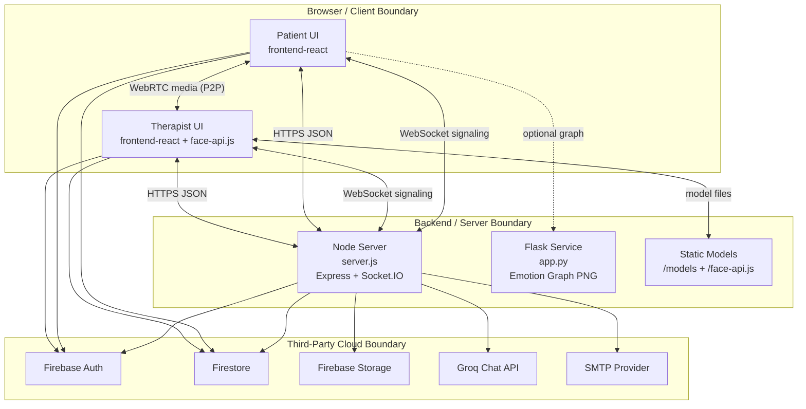

# TheraSense Production Codebase Audit

## SECTION 1 - Project Architecture

### 1.1 Purpose, Domain, and Core Problem
TheraSense is a mental-health teleconsultation platform that combines role-based care workflows (patient and therapist), synchronous video sessions, in-browser emotion inference, session analytics/reporting, and automated communication flows (booking/reminder/emergency/therapist-follow-up emails).

Core problem solved:
- Provide a single workflow where therapy sessions, emotional telemetry, journaling, reporting, and outreach all stay connected.
- Give therapists structured emotional trend data during and after calls.
- Keep the patient journey continuous between sessions (journal, chatbot, assignments, reports).

### 1.2 Architectural Pattern
The implemented architecture is a layered hybrid monolith with embedded submodules:
- Frontend SPA layer: React/Vite app in `frontend-react`.
- Backend API/signaling layer: Node/Express/Socket.IO in `server.js`.
- Optional Python microservice layer: Flask emotion graph service in `app.py`.
- Data/Auth layer: Firebase Auth + Firestore (and optional Firebase Storage fallback).
- Embedded third-party/asset layers: vendored `face-api.js`, `models`, and ML training sandbox under `Face_Emotion_Recognition_Machine_Learning`.

It is not a microservice deployment in the strict sense; production runtime is primarily one Node process serving API, static assets, and signaling.

### 1.3 Layers, Tiers, and Relationships
1. Client/UI tier (`frontend-react/src`)
- Routing, auth UX, role guards, dashboard pages, session workflows, report rendering/PDF, chatbot UI.
- Therapist page performs face inference directly in browser against remote stream.

2. Real-time signaling tier (`server.js` + Socket.IO)
- In-memory `sessions` map tracks patient/therapist socket IDs.
- Forwards `signal`, `offer`, `answer`, `ice-candidate`, and `emotion_update` events between peers.

3. API and orchestration tier (`server.js`)
- Chat endpoints (`/api/chat`, `/chat`) call Groq LLaMA-compatible endpoint.
- Assignment generation endpoint (`/api/assignments/generate`).
- Email endpoints (`/send-booking-email`, `/send-reminder-email`, `/send-report-email`, `/send-therapist-note`, `/send-emergency-email`).
- Journal media upload/read endpoints (`/upload-journal-media`, `/journal-media`).
- Cron-based reminder scanner every minute.

4. Data and identity tier (Firebase)
- Auth from frontend SDK.
- Firestore collections: `users`, `sessions`, `reports`, `journals`, `therapistPatients`, `assignments`, `responses`.
- Server uses Firebase Admin SDK for privileged reads/writes.

5. Optional analytics/image tier (`app.py`)
- Receives emotion updates and renders confidence graph PNG.

6. Embedded model/library tier
- `face-api.js`: vendored upstream library source/test/examples/dist.
- `models`: local model manifests/shards for runtime emotion/face detection.
- `Face_Emotion_Recognition_Machine_Learning`: standalone Python experimentation/training scripts.

### 1.4 Key Technologies (Detected Versions)
Backend (root `package.json`):
- Node.js runtime assumed (version not pinned in `engines`).
- Express `^5.2.1`
- Socket.IO `^4.8.3`
- Firebase Admin `^13.7.0`
- Nodemailer `^8.0.4`
- node-cron `^4.2.1`
- dotenv `^16.6.1`
- @google/generative-ai `^0.21.0` (currently imported but unused in server logic)

Frontend (`frontend-react/package.json`):
- React `^18.3.1`, React DOM `^18.3.1`
- Vite `^5.4.7`
- React Router DOM `^6.26.1`
- Firebase SDK `^10.14.1`
- Recharts `^3.8.1`, Chart.js `^4.4.3`
- Three `^0.183.2`, @react-three/fiber `^8.16.8`, @react-three/drei `^9.110.0`
- jsPDF `^4.2.1`, html2canvas `^1.4.1`

Python (`requirements.txt`, `Face_Emotion_Recognition_Machine_Learning/requirements.txt`):
- Flask `>=3.0.0`
- matplotlib `>=3.8.0`
- TensorFlow/Keras/OpenCV stack in ML submodule requirements.

### 1.5 External Services and APIs
- Firebase Authentication
- Cloud Firestore
- Firebase Storage (optional with local fallback for uploads)
- Groq OpenAI-compatible API (`https://api.groq.com/openai/v1/chat/completions`)
- Gmail/SMTP provider for outgoing mail
- Google STUN (`stun:stun.l.google.com:19302`)

### 1.6 Plain-Text Architecture Diagram (Mermaid)


### 1.7 Environment and Runtime Assumptions
Required runtime assumptions:
- Node + npm installed; Python 3 installed.
- Firebase project configured; Firestore rules deployed.
- Frontend built to `frontend-react/dist` for Node static hosting.

Environment/config files expected:
- Root: `.env`, `.env.example`, `firebase.json`, `firestore.rules`, `cors.json`, `storage.cors.json`.
- Frontend: `frontend-react/.env`, `frontend-react/.env.example`.

Key env vars (observed):
- Backend AI/mail/storage: `LLAMA_API_KEY`, `LLAMA_MODEL`, `GEMINI_API_KEY`, `EMAIL_USER`, `EMAIL_PASS`, `SMTP_HOST`, `SMTP_PORT`, `SMTP_SECURE`, `FROM_EMAIL`, `APP_BASE_URL`, `USE_LOCAL_JOURNAL_UPLOADS`.
- Firebase admin: `FIREBASE_PROJECT_ID`, `FIREBASE_CLIENT_EMAIL`, `FIREBASE_PRIVATE_KEY`, `FIREBASE_STORAGE_BUCKET`.
- Frontend: `VITE_FIREBASE_*`, `VITE_GEMINI_API_KEY`, optional TURN server vars.

## SECTION 2 - File and Module Breakdown

### 2.1 Repository-Level Summary
This workspace contains three types of content:
- First-party application code (Node API, React SPA, Python helper service).
- Embedded third-party vendor package (`face-api.js`) including source, tests, examples, dist, and model weights.
- Generated/runtime artifacts (`frontend-react/dist`, logs) and binary model assets (`models`, `weights`).

Because the repository contains more than 30 files, files are grouped by directory first, then listed with per-file details for first-party code and compact cataloging for vendor/generated directories.

### 2.2 Root Directory (`/`)
Directory responsibility:
- Primary orchestration and backend runtime entry points.
- Firebase policy/config files and environment templates.

Files:
- `.env`: local runtime secrets; loaded by `server.js`; side effect is environment injection at process start.
- `.env.example`: template of required backend environment variables; depended on by onboarding/deployment.
- `.gitignore`: excludes secrets, build outputs, model shards, and local environments.
- `app.py`: Flask microservice for in-memory emotion history and generated PNG graph; exports route handlers (`/update-emotion`, `/emotion-graph`, `/health`); no imports from local files; standalone runtime.
- `architecture_1.png`, `architecture_2.png`: static architecture images for documentation.
- `architecture_prompt.md`: prompt/spec for generating Mermaid architecture diagrams.
- `audit_files.txt`, `audit_comment_markers.txt`, `frontend_orphans.txt`: generated audit artifacts from local analysis tooling.
- `cors.json`, `storage.cors.json`: Firebase Storage CORS policy definitions.
- `firebase-debug.log`: local Firebase CLI debug output.
- `firebase.json`: Firebase config referencing `firestore.rules`.
- `firestore.rules`: Firestore authz policies; enforces patient/therapist role constraints and assignment checks.
- `ngrok.txt`: local ngrok helper note.
- `package.json`: root scripts and backend dependencies.
- `package-lock.json`: dependency lockfile for root package.
- `PROJECT_BACKEND_SYSTEM_GUIDE.md`, `PROJECT_FROM_SCRATCH_COMPLETE_GUIDE.md`: project documentation guides.
- `README.md`: this codebase audit.
- `requirements.txt`: Python dependencies for `app.py`.
- `server.js`: monolithic Node backend (API + static serving + sockets + email + cron + chatbot + upload handling).

### 2.3 VS Code Settings (`.vscode/`)
- `.vscode/settings.json`: workspace/editor settings; consumed only by VS Code.

### 2.4 Frontend Application (`frontend-react/`)
Directory responsibility:
- Main user-facing SPA and therapist/patient workflows.

Top-level files:
- `.env`, `.env.example`: frontend environment values.
- `build-output.log`: generated build artifact log.
- `index.html`: Vite HTML entry template.
- `package.json`, `package-lock.json`: frontend dependencies/scripts.
- `postcss.config.js`, `tailwind.config.js`, `vite.config.js`: CSS/build/proxy configuration.
- `public/teleconsultation-pitch-deck.html`: static marketing/deck content.
- `dist/index.html`, `dist/teleconsultation-pitch-deck.html`, `dist/models/README.txt`: generated build output (do not edit by hand).

Source entry files (`frontend-react/src`):
- `main.jsx`: React bootstrap; imports providers and router; depended on by Vite entry.
- `App.jsx`: route registry and guard composition; imports lazy pages and chatbot; depended on by `main.jsx`.
- `index.css`: global styling and design system classes.

Context modules:
- `context/AuthContext.jsx`: auth state subscription (`onAuthStateChanged`) + role resolution (`getUserRole`); consumed by route guards/hooks/pages.
- `context/ThemeContext.jsx`: dark/light/system state persisted in localStorage and reflected to document root.

Layout modules:
- `layout/Layout.jsx`: shell wrapper with responsive sidebar and navbar.
- `layout/Navbar.jsx`: top nav (profile/actions/alerts).
- `layout/Sidebar.jsx`: role-aware nav links and call CTA; imports workspace data hooks and session join helper.

Library modules:
- `lib/firebase.js`: initializes Firebase app/auth/firestore/storage/analytics.
- `lib/geminiApi.js`: direct Gemini REST helper from browser (currently not wired into primary chatbot path).
- `lib/socket.js`: singleton socket.io client (`io()`).

Hooks:
- `hooks/useUserRole.js`: convenience wrapper over AuthContext.
- `hooks/useDraggablePip.js`: draggable picture-in-picture behavior.
- `hooks/usePatientWorkspaceData.js`: fetches/aggregates patient sessions/reports/therapists; books sessions and triggers booking email.
- `hooks/useTherapistWorkspaceData.js`: therapist session/report data and status transitions.
- `hooks/useDemoSignaling.js`: demo-only signaling helper using `lib/socket` (`join-role`/`peer-status`), not aligned with current server events.

Primary pages (active via `App.jsx`):
- `pages/LandingPage.jsx`: public marketing landing page.
- `pages/Login.jsx`: sign-in/sign-up with role assignment and Google auth onboarding.
- `pages/Dashboard.jsx`: role-adaptive overview.
- `pages/Sessions.jsx`: appointment list, filters, and booking.
- `pages/Patient.jsx`: patient WebRTC client, socket signaling, media controls, sidebar.
- `pages/Therapist.jsx`: therapist WebRTC + emotion inference + timeline/report generation + email/report actions.
- `pages/VideoCall.jsx`: role-based dispatcher to `Patient` or `Therapist` page.
- `pages/Reports.jsx`: report retrieval, therapist notes, charting, and PDF export.
- `pages/Profile.jsx`: profile settings.
- `pages/Journal.jsx`: journaling UI with media upload.
- `pages/TherapistJournal.jsx`: therapist review of assigned patient journals.
- `pages/Resources.jsx`: static coping resources and crisis links.
- `pages/SettingsPage.jsx`: user settings and toggles.
- `pages/Assignments.jsx`: assignment creation/generation and response workflows.

Legacy/alternate pages present but not routed in `App.jsx`:
- `pages/LoginPage.jsx`, `pages/PatientDashboard.jsx`, `pages/PatientHome.jsx`, `pages/ProfilePage.jsx`, `pages/TherapistDashboard.jsx`, `pages/TherapistHome.jsx`, `pages/TherapistReports.jsx`, `pages/TherapistSessions.jsx`.

Component modules (selected responsibilities):
- `components/ProtectedRoute.jsx`, `components/PublicRoute.jsx`: route authorization wrappers.
- `components/SessionCard.jsx`: session action button logic (`accept/start/join/end`) by role/state.
- `components/AppointmentForm.jsx`: booking form UI.
- `components/VideoControls.jsx`, `components/CallTopbar.jsx`: live call controls/status bars.
- `components/EmotionPanel.jsx`, `components/Graph.jsx`, `components/SessionReportCard.jsx`: therapist emotion telemetry + report panel.
- `components/Chatbot.jsx`: floating chat UI that calls `/api/chat`.
- `components/ChatWindow.jsx` and `components/ChatWidget.jsx`: alternate chat widget path (calls `/chat`), voice input enabled.
- `components/TherapistNotes.jsx`, `components/TherapistMessenger.jsx`: therapist notes/messaging utilities.
- `components/Report.jsx`, `components/ReportList.jsx`, `components/SessionTimelineReplay.jsx`: report rendering/replay widgets.
- `components/EmergencyButton.jsx`: geolocation + emergency email trigger.
- `components/Dashboard.jsx`, `components/DashboardShell.jsx`, `components/SessionList.jsx`, `components/PatientJournal.jsx`, `components/ProfileMenu.jsx`, `components/NotificationsBell.jsx`: legacy or auxiliary dashboard widgets.
- `components/ui/*`: reusable UI primitives (`Badge`, `Buttons`, `Card`, `EmptyState`, `SearchBar`, `SectionHeader`, `Toggle`).

Utility modules:
- `utils/auth.js`: Firestore role lookup and dashboard path helpers.
- `utils/sessionCall.js`: session validation + join behavior (sessionStorage side effects).
- `utils/sessionAnalytics.js`: stress scoring/mood derivation/session metadata helpers.
- `utils/reportBuilder.js`: canonical therapist report payload construction.
- `utils/generatePDF.js`: PDF rendering helpers.
- `utils/generateClinicalSessionPdf.js`: clinical report PDF path.
- `utils/analyzeEmotions.js`: summary analysis helper for legacy report component.
- `utils/advancedReport.js`: trend/risk/suggestions builder.

Data/styles/3D:
- `data/mockData.js`: static mock datasets.
- `styles/journalReports.css`: reports/journal-specific styling.
- `three/BrainModel.jsx`, `three/BrainScene.jsx`: optional 3D scene/background model rendering.

### 2.5 Node Backend (`server.js`)
Module responsibility:
- Single-file backend handling static file serving, WebSocket signaling, AI chat proxying, email workflows, uploads, and reminder cron.

Key internal functions and responsibilities:
- Firebase init: `createFirebaseAdminApp` with env credentials and local-service-account fallback.
- Session signaling state: `getSessionState`, `registerSessionPeer`, `routeSignal`, `unregisterSessionPeer`, `emitSessionState`.
- Email infrastructure: `buildEmailLayout`, `sendEmail`, `sendBookingEmailBySession`, `sendReminderEmailBySession`, `sendEmergencyEmail`, `sendReportEmailsByPayload`, `sendTherapistFollowUpEmail`.
- Journal uploads: `sanitizeFileName`, `detectMediaKind`, `getStorageBucketCandidates`, upload/read endpoints.
- AI chat/assignments: `generateGroqReply`, `generateAssignmentQuestionsWithLlama`, `bookSessionFromChat`, `chatHandler`, parser helpers (`parseBookingDate`, `parseBookingTime`, etc.).

Imports and dependencies:
- Node core: `path`, `fs`, `http`.
- External: `express`, `socket.io`, `dotenv`, `node-cron`, `nodemailer`, `firebase-admin`, `@google/generative-ai`.

Files depending on backend API routes:
- `frontend-react/src/components/Chatbot.jsx`, `frontend-react/src/components/ChatWindow.jsx`.
- `frontend-react/src/pages/Assignments.jsx`.
- `frontend-react/src/pages/Journal.jsx`.
- `frontend-react/src/hooks/usePatientWorkspaceData.js`.
- `frontend-react/src/components/EmergencyButton.jsx`.
- `frontend-react/src/pages/Therapist.jsx`, `frontend-react/src/components/TherapistNotes.jsx`.

### 2.6 Python Service (`app.py`)
Module responsibility:
- Lightweight in-memory emotion timeline and PNG graph generation.

Key functions:
- `_build_graph_png`: creates matplotlib confidence timeline image.
- `add_cors_headers`: permissive CORS response headers.
- `update_emotion`: ingests emotion datapoint and returns graph PNG.
- `emotion_graph`: returns latest graph PNG.
- `health`: liveness endpoint.

Dependents:
- No direct runtime caller in current frontend/backend code; can be used as optional side service.

### 2.7 ML Sandbox (`Face_Emotion_Recognition_Machine_Learning/`)
Directory purpose:
- Standalone experimentation/training/test scripts for facial emotion model, separate from production browser inference path.

Files:
- `README.md`: minimal project note.
- `requirements.txt`: TensorFlow/Keras/OpenCV stack.
- `realtimedetection.py`: webcam emotion detection script loading local model JSON/H5 and Haar cascade.
- `test_model.py`: model-load validation using dummy tensor prediction.
- `trainmodel.ipynb`: training notebook artifact.

### 2.8 Embedded face-api Library (`face-api.js/`)
Directory purpose:
- Vendored upstream package, currently served statically by `server.js` and consumed by therapist browser runtime.

Top-level files:
- `.gitignore`, `.npmignore`, `.travis.yml`, `LICENSE`.
- `package.json`, `package-lock.json`.
- Build config: `rollup.config.js`, `tsconfig*.json`, `typedoc.config.js`, `karma.conf.js`, `jasmine-node.js`.
- `README.md` and `dist/face-api.js`, `dist/face-api.min.js`, map.

Source modules (`face-api.js/src`):
- Core entry: `index.ts`, `NeuralNetwork.ts`, `euclideanDistance.ts`, `resizeResults.ts`.
- Model families and support: `ageGenderNet`, `faceExpressionNet`, `faceFeatureExtractor`, `faceLandmarkNet`, `faceProcessor`, `faceRecognitionNet`, `ssdMobilenetv1`, `tinyFaceDetector`, `tinyYolov2`, `xception`, `mtcnn`, `ops`, `dom`, `draw`, `env`, `classes`, `common`, `globalApi`, `factories`, `utils`.
- Responsibility: neural net definitions, tensor ops, face detection/landmark/expression pipelines, API composition.

Examples/tests/assets:
- `examples/examples-browser/*`, `examples/examples-nodejs/*`, `examples/media/*`.
- `test/*`, `test/tests/*`, `test/tests-legacy/*`, `test/data/*`, `test/media/*`.
- `weights/*` model shard/manifests.

Import/dependency note:
- This vendor package is internally self-contained and not imported by local source tree through ES module paths; it is loaded at runtime via static script URL in therapist page.

### 2.9 Model Asset Directories
- `models/*`: runtime model files used by therapist browser inference and potentially 3D asset lookup (`brain.glb` expected by `BrainScene`, not present in observed `models` listing).
- `weights/*`: face-api package weight shards/manifests for examples/tests.

### 2.10 Generated and Documentation Artifacts
- `frontend-react/dist/*`: built frontend output.
- `frontend-react/public/models/README.txt`: static note for model placement.
- `PROJECT_BACKEND_SYSTEM_GUIDE.md`, `PROJECT_FROM_SCRATCH_COMPLETE_GUIDE.md`, `architecture_prompt.md`: operational documentation.

## SECTION 3 - Known Issues and Areas Needing Work

### 3.1 Marker Comment Scan
No comment markers matching TODO/FIXME/HACK/XXX/NOTE were found in text source files during this audit scan.

### 3.2 Security and Configuration Risks
1. File and line:
- `frontend-react/src/lib/firebase.js:10`
Problem:
- Firebase API key and project identifiers are hardcoded in source instead of using `VITE_FIREBASE_*` env vars.
Suggested fix:
- Replace hardcoded values with `import.meta.env` reads and fail-fast validation at app startup.

2. File and line:
- `frontend-react/.env.example:7`
Problem:
- A concrete-looking Gemini key value is present in template.
Suggested fix:
- Replace with obvious placeholder (`your_gemini_api_key_here`) and rotate any exposed key.

3. File and lines:
- `server.js:1323`, `server.js:1335`, `server.js:1347`, `server.js:1357`, `server.js:1367`
Problem:
- Email endpoints are callable without explicit auth/authorization checks.
Suggested fix:
- Require Firebase ID token verification and role-based authorization middleware before sending any email.

4. File and line:
- `server.js:18`
Problem:
- Socket.IO CORS allows `origin: '*'`.
Suggested fix:
- Restrict to known frontend origins by environment.

5. File and lines:
- `server.js:36`, `server.js:618`
Problem:
- Local journal uploads are enabled by default and served as static public files.
Suggested fix:
- Default to secure storage with signed URL access; if local fallback is needed, gate access and scrub metadata.

6. File and line:
- `storage.cors.json:6`
Problem:
- CORS includes wildcard origin `*` for storage operations.
Suggested fix:
- Use explicit allowed origins per environment.

### 3.3 Incomplete or Placeholder Behavior
1. File and line:
- `frontend-react/src/utils/sessionCall.js:61`
Problem:
- Placeholder fallback (`joinCall placeholder`) still executes alert instead of deterministic join behavior when room metadata is incomplete.
Suggested fix:
- Treat missing room info as error path with actionable UI and logging; avoid placeholder alerts in production flow.

2. File and lines:
- `frontend-react/src/pages/Therapist.jsx:404-412` (routing note string), `frontend-react/src/pages/Therapist.jsx:414-435`
Problem:
- Therapist-selected Keras model path is acknowledged but not actually used for inference; logic always routes to face-api.
Suggested fix:
- Either implement browser-compatible Keras inference path (TensorFlow.js converted model) or remove selectable option until implemented.

### 3.4 Dead Code / Unused Modules Candidates
1. File and lines:
- `server.js:10`, `server.js:28`, `server.js:29`, `server.js:782`
Problem:
- Gemini objects (`GoogleGenerativeAI`, `GEMINI_MODEL`, `genAI`) and `getSystemPrompt` are defined but not used in active chat path.
Suggested fix:
- Remove dead code or integrate dual-provider strategy explicitly.

2. Files:
- `frontend-react/src/pages/LoginPage.jsx`
- `frontend-react/src/pages/PatientDashboard.jsx`
- `frontend-react/src/pages/PatientHome.jsx`
- `frontend-react/src/pages/ProfilePage.jsx`
- `frontend-react/src/pages/TherapistDashboard.jsx`
- `frontend-react/src/pages/TherapistHome.jsx`
- `frontend-react/src/pages/TherapistReports.jsx`
- `frontend-react/src/pages/TherapistSessions.jsx`
Problem:
- Legacy/alternate pages exist but are not routed in `App.jsx`.
Suggested fix:
- Decide whether to delete, migrate, or expose these routes to avoid maintenance drift.

3. File and line:
- `frontend-react/src/hooks/useDemoSignaling.js:1-39`
Problem:
- Uses demo event names (`join-role`, `peer-status`) that do not match server signaling events (`join-session`, `session-state`); likely legacy/demo-only.
Suggested fix:
- Remove or refactor to current signaling protocol and document intended usage.

### 3.5 Hardcoded Values and Brittle Assumptions
1. File and lines:
- `server.js:22`, `server.js:33`, `server.js:34`, `server.js:58`
Problem:
- Hardcoded defaults for `PORT`, `APP_BASE_URL`, fallback Firebase project ID, and local service-account filename create environment coupling.
Suggested fix:
- Move all environment defaults into explicit config module with strict validation and environment-specific overrides.

2. File and lines:
- `frontend-react/src/pages/Therapist.jsx:65`, `frontend-react/src/pages/Therapist.jsx:69`
Problem:
- Hardcoded localhost fallback URLs for face-api script/models.
Suggested fix:
- Resolve from one runtime config source (environment + current origin) and avoid localhost assumptions in deployed environments.

3. File and line:
- `frontend-react/src/components/Resources.jsx` (crisis links and static resources)
Problem:
- Static crisis phone/text values are hardcoded and region-specific.
Suggested fix:
- Externalize to locale-aware config/content management.

### 3.6 Error Handling and Operational Gaps
1. File and line:
- `server.js:1377`
Problem:
- Cron job scans entire `sessions` collection every minute; scalability risk for large datasets.
Suggested fix:
- Query only pending sessions inside reminder window with indexed timestamp/status fields.

2. File and lines:
- `frontend-react/src/components/ProtectedRoute.jsx:8`, `frontend-react/src/components/PublicRoute.jsx:7`
Problem:
- Loading state returns `null`, causing blank screen without skeleton/error fallback.
Suggested fix:
- Render minimal loading shell to improve UX/debuggability.

3. File and lines:
- `frontend-react/src/pages/Patient.jsx` and `frontend-react/src/pages/Therapist.jsx` (many `console.log` paths)
Problem:
- Verbose debug logging in production paths can expose metadata and clutter diagnostics.
Suggested fix:
- Gate logs behind debug flag or central logger with log levels.

### 3.7 Tight Coupling and Change Fragility
1. Coupling point:
- Frontend session status handling repeated in multiple files (`SessionCard`, `Sessions`, `Sidebar`, `useTherapistWorkspaceData`, `sessionCall`) with ad hoc normalization.
Risk:
- Status vocabulary change can break behavior inconsistently.
Suggested fix:
- Centralize enum and normalization utility in one shared module used everywhere.

2. Coupling point:
- Signaling protocol and peer restart logic duplicated across `pages/Patient.jsx` and `pages/Therapist.jsx`.
Risk:
- Any protocol change requires synchronized edits in two long files.
Suggested fix:
- Extract shared WebRTC/signaling engine hook/service with role-specific adapters.

3. Coupling point:
- Report shape assumptions span `Therapist.jsx`, `Reports.jsx`, `utils/reportBuilder.js`, `utils/generatePDF.js`, `utils/generateClinicalSessionPdf.js`.
Risk:
- Payload schema drift can break PDF/report rendering silently.
Suggested fix:
- Define validated report schema contract and enforce with runtime validation/tests.

### 3.8 Documentation Drift
1. Files:
- Existing historical README content (replaced by this audit) asserted capabilities not fully aligned with active route wiring and included outdated structure details.
Suggested fix:
- Keep this README as source of truth and add a lightweight ADR/changelog process for architecture-level changes.
  role: "patient" | "therapist",
  emergencyEmail?: string,
  createdAt: timestamp,
  lastLogin: timestamp
}
```

### `sessions/{sessionId}`
```
{
  patientId: string,
  patientName: string,
  therapistId: string,
  therapistName: string,
  status: "pending" | "confirmed" | "active" | "completed" | "cancelled",
  roomId: string,
  scheduledAt: timestamp,
  startTime: timestamp,
  createdAt: timestamp,
  reminderEmailSentAt?: timestamp
}
```

### `reports/{reportId}`
```
{
  sessionId: string,
  patientId: string,
  therapistId: string,
  patientName: string,
  therapistName: string,
  summary: string,
  emotionSummary: string,
  emotionData: {
    timeline: [...],
    series: {...},
    recommendations: [...]
  },
  createdAt: timestamp
}
```

### `sessionMetadata/{sessionId}`
```
{
  sessionId, therapistId, patientId,
  startedAt, endedAt, durationMinutes,
  averageStressScore, maxStressScore,
  peakStressMoments: [...],
  moodChanges: [...],
  liveAlerts: [...],
  totalReadings,
  createdAt
}
```

### `journals/{journalId}`
```
{
  userId: string,
  role: "patient",
  content: string,
  mood: number | null,   // 1–10 scale
  createdAt: timestamp
}
```

### `therapistPatients/{therapistId_patientId}`
```
{
  therapistId: string,
  patientId: string,
  createdAt: timestamp
}
```
> This bridge collection is required for Firestore rules to grant therapists access to their assigned patients' journals.

---

## Core Flows

### Authentication Flow

```
User → Login.jsx
  → Firebase signInWithEmailAndPassword / Google popup
  → Firestore users/{uid} created/updated
  → AuthContext.onAuthStateChanged fires
  → Role fetched from users/{uid}.role
  → ProtectedRoute redirects to /dashboard
  → Dashboard renders PatientHome or TherapistHome
```

### Session Booking Flow

```
Patient → AppointmentForm.jsx
  → Firestore: write sessions/{id}  (status: "pending")
  → Firestore: write therapistPatients/{therapistId_patientId}
  → POST /send-booking-email  { sessionId, meetingLink }
    → Backend fetches session + user profiles via Admin SDK
    → Nodemailer sends confirmation to patient AND therapist
```

### Video Call & WebRTC Flow

```
Both users navigate to /patient or /therapist
  → Validate session status === "active"
  → Socket.IO: emit join-session { sessionId, role }
  → Server: registers socket in memory peer map
  → Server: emits session-state { patientConnected, therapistConnected }
  → Initiator creates RTCPeerConnection, getUserMedia
  → Offer sent via Socket.IO signal event
  → Responder answers, ICE candidates exchanged via signal
  → Direct peer-to-peer media stream established
  → [MEDIA NEVER TOUCHES THE SERVER]
```

### Emotion Detection Flow

```
Therapist.jsx starts after remote stream is available:
  1. Load /face-api.js/dist/face-api.js from backend static route
  2. Load model weights from /models (TinyFaceDetector + FaceExpressionNet)
  3. Start interval loop every ~200ms
  4. faceapi.detectSingleFace(remoteVideoEl).withFaceExpressions()
  5. Extract top emotion + confidence score
  6. Derive stress score (fearful, angry, sad weighted)
  7. Append to in-memory timeline (bounded by TIMELINE_LIMIT)
  8. Trigger live alert if stress score > threshold
  9. Emit emotion_update signal to patient socket
  10. Update Graph.jsx + EmotionPanel.jsx in real time

[On call end]
  → buildTheraSenseReport(timeline) → Firestore reports
  → buildSessionMetadata(timeline)  → Firestore sessionMetadata
```

### Report Generation Flow

```
Therapist ends call
  → reportBuilder.js computes:
      - dominant emotion
      - stress / risk label
      - emotion percentage breakdown
      - AI recommendations list
      - session summary string
  → Save to Firestore reports/{id}
  → Save to Firestore sessionMetadata/{sessionId}
  → Patient/Therapist can view on /reports
  → Export as PDF via:
      DOM path: html2canvas → jsPDF
      Data path: jsPDF direct text writing
```

### AI Chatbot

The chatbot floats on all authenticated pages and is role-aware:

```
User sends message in Chatbot.jsx
  ↓
Frontend (direct path):
  sendGeminiMessage(message, role, history)
  → @google/generative-ai with VITE_GEMINI_API_KEY
  → Returns text reply

OR

Backend path:
  POST /chat  { message, role }
  → server.js Gemini call with GEMINI_API_KEY
  → Returns { reply: "..." }
```

> ⚠️ For production, use only the **backend path** to keep your Gemini API key server-side.

---

## Backend API Reference

Base URL: `http://localhost:3000`

### `POST /send-booking-email`

Sends booking confirmation emails to both patient and therapist.

**Request:**
```json
{
  "sessionId": "abc123",
  "meetingLink": "http://localhost:3000/patient?sessionId=abc123"
}
```
**Success:** `{ "ok": true }`
**Errors:** `400` missing sessionId · `500` session not found / SMTP failure

---

### `POST /send-reminder-email`

Sends session reminder (triggered ~10 min before scheduled time via cron).

**Request:**
```json
{ "sessionId": "abc123" }
```
**Success:** `{ "ok": true }` or `{ "skipped": true, "reason": "Already sent" }`

Skip reasons: `Session missing` · `Already sent` · `Not in reminder window` · `Missing email address`

---

### `POST /send-emergency-email`

Sends SOS alert with geo-location to the patient's emergency contact.

**Request:**
```json
{
  "patientId": "uid_patient",
  "emergencyEmail": "contact@example.com",
  "location": { "latitude": 12.34, "longitude": 56.78 }
}
```
**Success:** `{ "ok": true }`

---

### `POST /chat`

AI chatbot response endpoint (Gemini backend path).

**Request:**
```json
{
  "message": "I'm feeling anxious before my session",
  "role": "patient"
}
```
**Success:** `{ "reply": "...generated text..." }`
**Errors:** `400` message missing · `500` Gemini key missing or API error

---

### Socket.IO Events

| Direction | Event | Payload | Description |
|---|---|---|---|
| Client → Server | `join-session` | `{ sessionId, role }` | Register in session peer map |
| Server → Client | `join-session-ack` | `{ sessionId }` | Acknowledgement |
| Server → Client | `session-state` | `{ patientConnected, therapistConnected }` | Peer presence |
| Client ↔ Server | `signal` | `{ to, from, role, data }` | SDP offer/answer or ICE candidate |
| Client → Server | `emotion_update` | `{ ...emotionPayload }` | Forward emotion to peer context |

---

## Flask Emotion Graph Service

The Python micro-service (`app.py`) provides server-side emotion graph rendering using Matplotlib.

**Port:** `5000`

| Endpoint | Method | Description |
|---|---|---|
| `/update-emotion` | POST | Accepts `{ emotion, confidence, timestamp }`, appends to rolling 30-point history, returns PNG graph image |
| `/emotion-graph` | GET | Returns the latest cached PNG graph |
| `/health` | GET | Returns `{ ok: true, points: N }` |

**Start:**
```bash
pip install -r requirements.txt
python app.py
```

---

## Environment Variables

### Backend (`.env` in project root)

| Variable | Required | Description |
|---|---|---|
| `APP_BASE_URL` | ✅ | Base URL of the app, e.g. `http://localhost:3000` |
| `GEMINI_API_KEY` | ✅ | Google Gemini API key for chatbot |
| `FIREBASE_PROJECT_ID` | ✅ | Firebase project ID |
| `FIREBASE_CLIENT_EMAIL` | ✅ | Firebase service account email |
| `FIREBASE_PRIVATE_KEY` | ✅ | Firebase service account private key |
| `FIREBASE_STORAGE_BUCKET` | ⚪ | Firebase Storage bucket |
| `EMAIL_USER` | ✅ | SMTP username (Gmail address) |
| `EMAIL_PASS` | ✅ | SMTP app password |
| `SMTP_HOST` | ⚪ | Defaults to `smtp.gmail.com` |
| `SMTP_PORT` | ⚪ | Defaults to `587` |
| `SMTP_SECURE` | ⚪ | `false` for STARTTLS, `true` for SSL |
| `FROM_EMAIL` | ⚪ | Sender display name + address |

### Frontend (`frontend-react/.env`)

| Variable | Required | Description |
|---|---|---|
| `VITE_GEMINI_API_KEY` | ⚪ | Gemini key for direct frontend chat path |
| `VITE_TURN_URL` | ⚪ | TURN server URL for restrictive NAT networks |
| `VITE_TURN_USERNAME` | ⚪ | TURN server credential |
| `VITE_TURN_CREDENTIAL` | ⚪ | TURN server credential |

> Copy `.env.example` to `.env` and fill in your values before running.

---

## Getting Started

### Prerequisites

- **Node.js** 18+ and **npm** 9+
- **Python** 3.10+ and **pip**
- A **Firebase project** with Authentication and Firestore enabled
- A **Google Gemini API key** ([Get one here](https://aistudio.google.com/app/apikey))
- A Gmail account with an **App Password** for SMTP

### Firebase Setup

1. Create a Firebase project at [console.firebase.google.com](https://console.firebase.google.com)
2. Enable **Email/Password** and **Google** authentication providers
3. Create a **Firestore** database in production mode
4. Generate a **Service Account** key (Project Settings → Service Accounts → Generate new private key)
5. Add your `firestore.rules` from the project to your Firebase project
6. Register a **Web App** and copy the Firebase config into `frontend-react/src/lib/firebase.js`

---

## Running the Project

### Install Dependencies

```bash
# Backend (from project root)
npm install

# Frontend
cd frontend-react
npm install
cd ..

# Python micro-service
pip install -r requirements.txt
```

### Configure Environment

```bash
# Copy and fill in backend env
cp .env.example .env

# Copy and fill in frontend env
cp frontend-react/.env.example frontend-react/.env
```

### Start All Services

#### Option 1 — Run everything at once (requires ngrok installed)
```bash
npm run dev
# Starts: node server.js + vite dev server + ngrok tunnel
```

#### Option 2 — Run separately (recommended for debugging)

```bash
# Terminal 1: Node backend
npm run server

# Terminal 2: React frontend
cd frontend-react && npm run dev

# Terminal 3: Python emotion graph service (optional)
python app.py
```

### Ports

| Service | Port |
|---|---|
| Node.js backend | `3000` |
| Vite dev server | `5173` |
| Flask emotion service | `5000` |

> In development, Vite proxies `/chat`, `/send-*-email`, `/socket.io`, `/models`, and `/face-api.js` to `http://localhost:3000`.
>
> In production, the Node backend serves the `frontend-react/dist` build directly on port `3000`.

### Build for Production

```bash
cd frontend-react
npm run build
# Output goes to frontend-react/dist/
# Served automatically by node server.js at port 3000
```

---

## Common Issues & Troubleshooting

### WebRTC — No Remote Video

- Ensure **both peers** joined with the same `sessionId`
- Confirm session `status === "active"` in Firestore
- Check browser permissions for camera and microphone
- In restrictive corporate/university networks, configure `VITE_TURN_URL` + credentials
- Inspect Socket.IO connectivity at `http://localhost:3000/socket.io`

### Firebase Auth — Role Missing / Redirect Loop

- Verify `users/{uid}` document exists in Firestore with a `role` field
- Confirm the Firebase config in `frontend-react/src/lib/firebase.js` points to the correct project
- Review Firestore rules — ensure reads on `users/{uid}` are allowed for authenticated users

### Email Not Sending

- Check `EMAIL_USER` and `EMAIL_PASS` are set correctly
- For Gmail, use an **App Password** (not your regular password) — [Generate one here](https://myaccount.google.com/apppasswords)
- 2-Step Verification must be enabled on the Gmail account

### Port Conflicts

```bash
# Check what's using a port (Windows)
netstat -ano | findstr :3000
netstat -ano | findstr :5173
```
Kill the process using the PID shown, or reconfigure ports in `.env` and `vite.config.js`.

### Emotion Detection Not Working

- Check browser console for face-api.js model load errors
- Ensure `/models` route is accessible: `http://localhost:3000/models`
- Camera must be active and patient's face visible in the remote video stream
- face-api.js requires HTTPS in some browsers — use ngrok for a TLS tunnel

### Duplicate Events / Messages

If you see duplicate socket events or repeated Firestore reads:
- Ensure `socket.off(event)` is called before re-registering listeners
- Verify cleanup functions in `useEffect` return `() => { socket.removeAllListeners(); }`

---

## Machine Learning Module

Located in `Face_Emotion_Recognition_Machine_Learning/`:

| File | Description |
|---|---|
| `trainmodel.ipynb` | Jupyter notebook for training the CNN emotion classification model on FER-2013 dataset |
| `realtimedetection.py` | Standalone Python + OpenCV real-time webcam emotion detection (uses trained `.h5` model) |
| `test_model.py` | Model evaluation script — runs predictions on test images and prints accuracy metrics |

> The trained model powers the in-browser emotion recognition via face-api.js (TinyFaceDetector + FaceExpressionNet weights, stored in `/models`).

---

## Contributing

1. Fork the repository
2. Create a feature branch: `git checkout -b feature/your-feature`
3. Commit your changes: `git commit -m 'Add some feature'`
4. Push to the branch: `git push origin feature/your-feature`
5. Open a Pull Request

---

## License

This project is licensed under the **ISC License**.

---

<div align="center">
  <strong>TheraSense</strong> — Bridging minds through intelligent teleconsultation.
</div>
